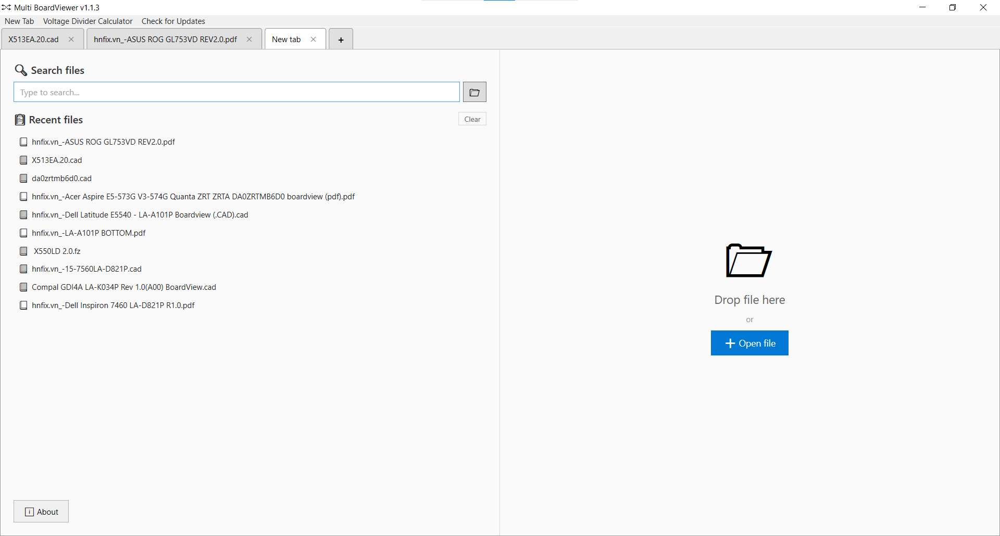
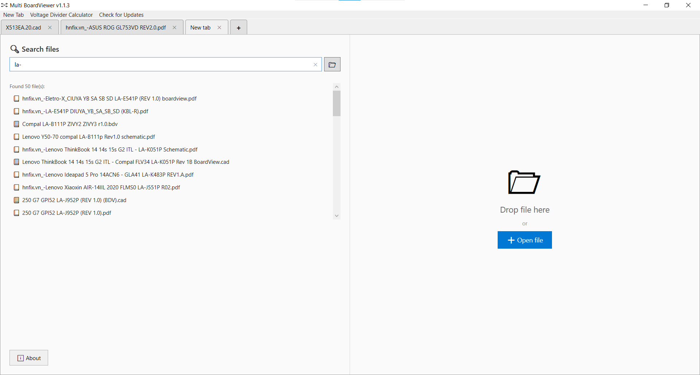
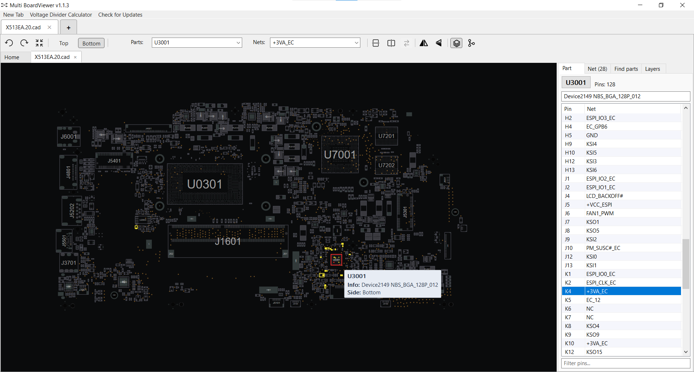
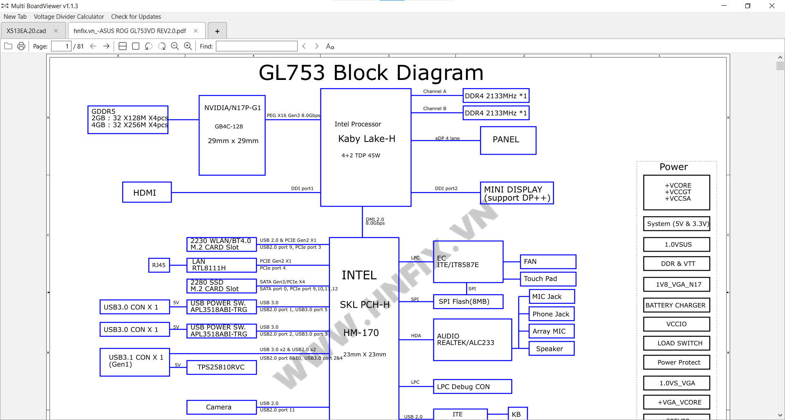

# Multi BoardViewer

Ứng dụng Windows giúp xem nhiều boardview và schematic trong cùng một ứng dụng

  

|  |  |
| :---: | :---: |
|  |  |

## Lời cảm ơn

Xin chân thành cảm ơn:

- **[NexusBV](https://www.facebook.com/reel/1269896708459349)** - phần mềm xem boardview hiện đại và mượt mà
- **[OpenBoardView](https://github.com/OpenBoardView)** - phần mềm xem boardview mã nguồn mở

- **[SumatraPDF](https://github.com/sumatrapdfreader)** - phần mềm đọc PDF mã nguồn mở

Dự án này sử dụng sản phẩm của họ để tạo nên trải nghiệm xem file đa năng trong một ứng dụng duy nhất

## Tính năng

- **Multi tab**: Mở nhiều file cùng lúc
- **Multi viewer**: Xem file boardview với 2 lựa chọn viewer (NexusBV, OpenBoardView)
- **PDF viewer**: Xem file PDF với SumatraPDF tích hợp
- **Search files**: Tìm kiếm file trong thư mục hoặc ổ đĩa chỉ định
- **Voltage Divider Calculator**: Tính toán điện áp qua cầu phân áp

## Yêu cầu hệ thống

- Windows 10/11
- [.NET 8.0 Runtime](https://dotnet.microsoft.com/download/dotnet/8.0)

## Cài đặt và chạy

### Cách 1: Tải bản Release

1. Tải file từ [Releases](https://github.com/mhqb365/Multi-BoardViewer/releases)
2. Giải nén và chạy `MultiBoardViewer.exe`

### Cách 2: Build từ source

```powershell
# Clone repository
git clone https://github.com/mhqb365/Multi-BoardViewer.git
cd Multi-BoardViewer

# Build
.\Build.bat

# Chạy
.\Run.bat
```

## Hướng dẫn sử dụng

### Mở file

- **Tab mới**: Click nút **+** để tạo tab mới → Kéo thả file vào phần cửa sổ bên phải của ứng dụng hoặc click nút **+ Open file** và dẫn đến file cần mở
- **Search files**: Chọn thư mục hoặc ổ đĩa chứa các file tài liệu ở icon thư mục → Nhập tên file vào ô tìm kiếm → Click file để mở bằng NexusBV, hoặc click chuột phải để mở bằng viewer khác. Nếu không mở được thì đóng tab rồi mở lại với viewer khác
- **Recent files**: Danh sách các file đã mở gần đây

### Định dạng file hỗ trợ

| NexusBV | `.brd`, `.bdv`, `.fz`, `.cad`, `.tvw`, `.asc`, v.v. |
| OpenBoardView | `.brd`, `.bdv`, `.fz`, `.cad`, v.v. |
| SumatraPDF | `.pdf` |

---

## Development

### Công nghệ

- **Framework**: WPF + C# .NET 8.0
- **Windows API**: SetParent, MoveWindow (Process embedding)
- **External Tools**: NexusBV, OpenBoardView, SumatraPDF, VoltageDividerCalculator

### Cấu trúc dự án

```
Multi-BoardViewer/
├── MultiBoardViewer/          # Source code chính (WPF .NET 8)
│   ├── Controls/              # User Controls (StartPage, etc.)
│   ├── Services/              # Services (FileSearch, RecentFiles)
│   ├── MainWindow.xaml        # Giao diện chính và quản lý tab
│   ├── App.xaml               # Cấu hình ứng dụng
│   └── ...
├── NexusBV/                   # Tool NexusBV (mặc định)
├── OpenBoardView/             # Tool OpenBoardView (mã nguồn mở)
├── SumatraPDF/                # Trình xem PDF (SumatraPDF)
├── VoltageDividerCalculator/  # Công cụ tính toán điện áp
├── Photos/                    # Hình ảnh minh họa cho README
├── MultiBoardViewer.sln       # Solution file
├── Build.bat                  # Script build tự động
└── Run.bat                    # Script chạy ứng dụng nhanh
```
